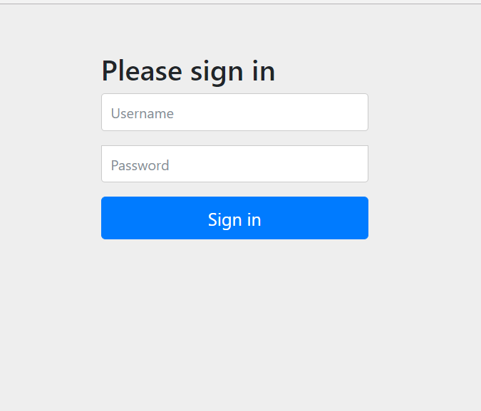
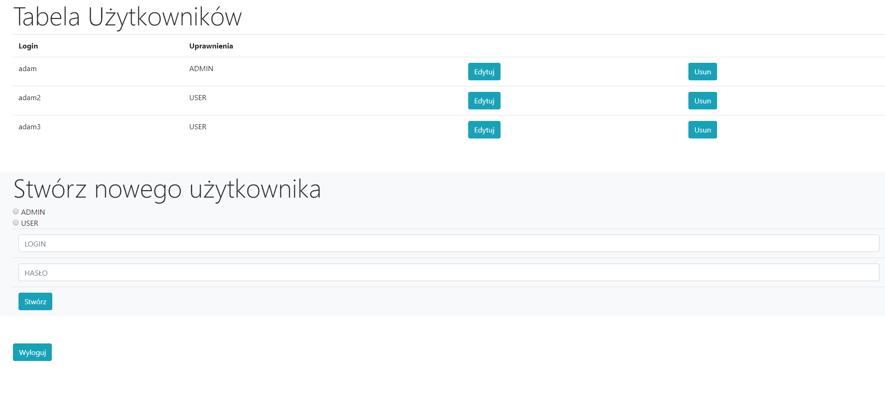
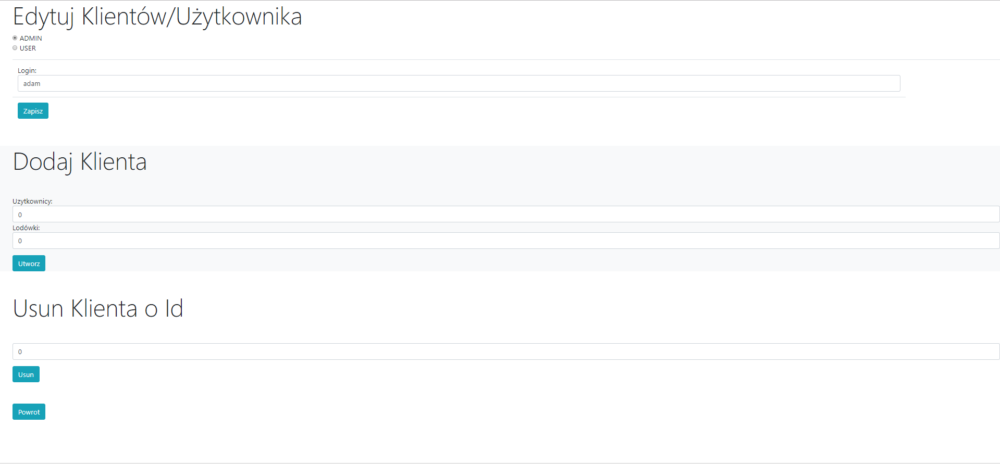
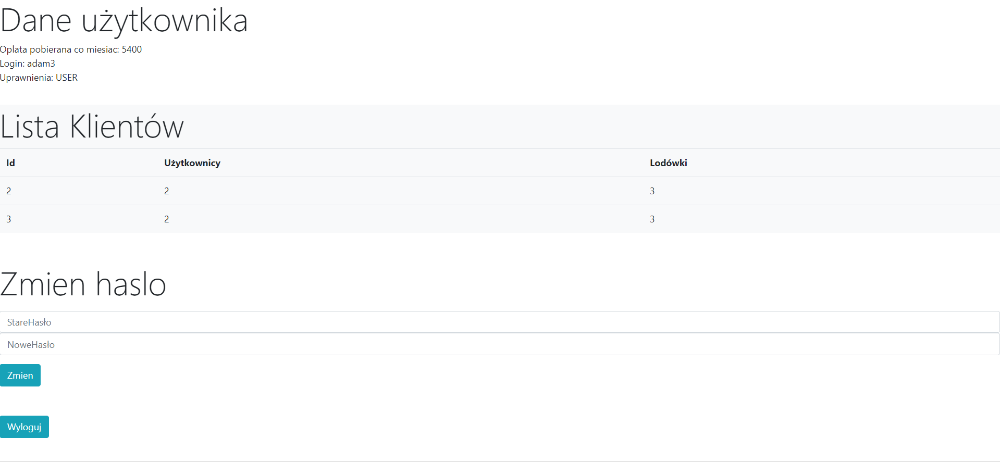

# projektSpring
Aplikacja napisana w springu/flyway/thymeleaf/bootstrap. Modeluje ona dwa rodzajów użytkowników: Admina i Organizację. Organizacja może posiadać 
użytkowników (każdy kosztuje 1000$ miesięcznie), a każdy użytkownik posiada lodówki i userów (odpowiednio 500$ i 100$). Aplikacja
pozwala zalogowanej organizacji wypisanie danych o niej, a Adminowi działania typu CRUD na bazię danych.

Dołączony już do security model logowania 

Ekran po zalogowaniu się na konto Admina. Pozwala ona na obejrzenie wszystkich rekordów w bazie, edycje ich, usuwanie a także tworzenie nowych

Ekran edycji na koncie Admin. Pozwala na tworzenie nowych użytkowników z daną lizcbą lodówek i userów, a także na usuwanie ich i zmiany
w nich, a także w organizacji.

Ekran po zalogowaniu się na konto organizacji. Pozwala on na obejrzenie danych danej organizacji, sumy kosztów a także na zmianę hasła

